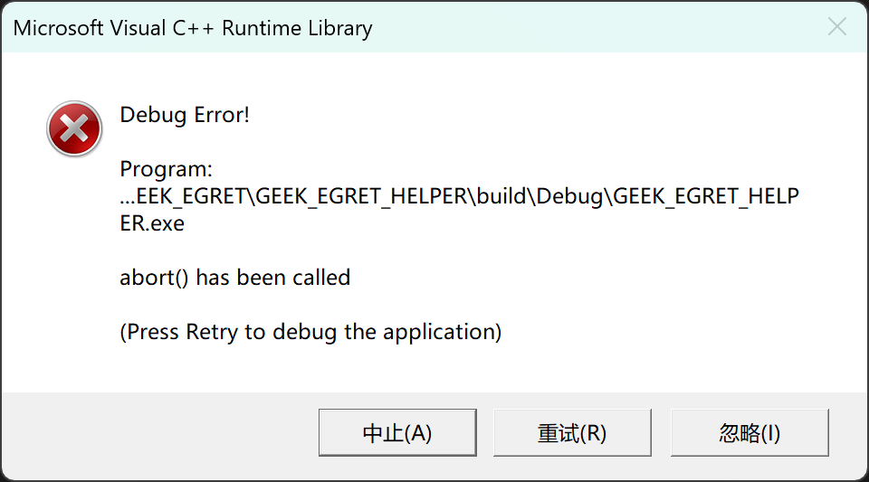
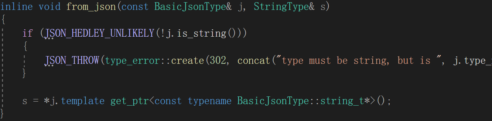
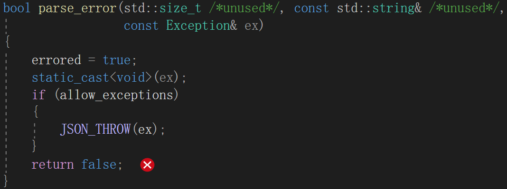

<i>GEEK EGRET助手
=====
## 介绍
----
## 软件使用教程
----
## 工程结构
```shell
├─build                     CMAKE\MAKE输出
├─inc                       头文件
├─config                    设置文件
├─lib                       库文件夹
│  ├─json                   JSON库
│  └─uart                   UART库
│      ├─linux
│      └─windows
├─out                       MSVC输出
├─res                       QT资源
│  ├─ui                     QT GUI界面文件
│  └─fonts                  QT界面翻译文件
├─platforms                 CMAKE配置文件
└─src                       源文件
```
----
## Windows编译环境搭建
[Visual Code](https://visualstudio.microsoft.com/zh-hans/vs/)
- Windows C/C++ 集成开发环境

[MinGw](https://github.com/skeeto/w64devkit/releases/tag/v2.0.0)
- GNU C/C++编译器

[CMake](https://github.com/Kitware/CMake/releases/download/v3.31.4/cmake-3.31.4-windows-x86_64.msi)
- 跨平台工程构建工具

[DirectX12](https://developer.microsoft.com/zh-cn/windows/downloads/windows-sdk/)
- Windows SDK自带，因此下载Windows SDK即可
- 该库为QT库的底层

[Qt](https://mirrors.tuna.tsinghua.edu.cn/qt/official_releases/online_installers/)
- 终端执行`.\[文件名] --mirror https://mirrors.ustc.edu.cn/qtproject`
- 打开环境变量，添加QT MSVC路径至`path`中

[NSIS](https://sourceforge.net/projects/nsis/files/latest/download)
- Windows安装包打包工具
----
## Linux编译环境搭建
### GCC
| Linux发行版 | 命令 |
| --- | --- |
| Debain系 | ` apt install gcc g++ ` |
| RedHat系 | ` yum -y install gcc gcc-c++ ` |
| Arch系 | ` pacman -S gcc ` |
### CMAKE
| Linux发行版 | 命令 |
| --- | --- |
| Debain系 | ` apt install cmake ` |
| RedHat系 | ` yum -y install cmake ` |
| Arch系 | ` pacman -S cmake ` |
### MAKE
| Linux发行版 | 命令 |
| --- | --- |
| Debain系 | ` apt install make ` |
| RedHat系 | ` yum -y install make ` |
| Arch系 | ` pacman -S make ` |
----
## 编译
### 工程编译配置
- 进入工程 `platforms`
- 根据自己平台对相应文件进行配置

| 编译配置文件 | 说明 |
| --- | --- |
| x86_64_window.cmake | x86_64架构的Windows系统编译配置文件 |
| x86_64_linux.cmake | x86_64架构的Linux系统编译配置文件 |
| aarch64_linux.cmake | aarch64架构的Linux系统编译配置文件 |

| 配置选项 | 说明 |
| ------- | ----- |
| `QT_ROOT_PATH` | 编译环境QT库安装目录 |
| `PROJECT_ROOT_PATH` | 工程根目录 |
| `PROJECT_CONFIG_FOLDER_COPY_PATH` | 工程设置文件夹复制目标路径，若是相对路径则是相对于可执行文件目录 |
| `SETUP_PACK_FLAG` | 是否打包安装包 |
### Windows编译流程
- 进入工程 `res/ui`
- 编译 .ui：文件终端执行
    - `uic main_window.ui -o ../../inc/ui_main_window.h`
    - `uic greet_window.ui -o ../../inc/ui_greet_window.h`
    - `uic config_window.ui -o ../../inc/ui_config_window.h`
    - `uic add_window.ui -o ../../inc/ui_add_window.h`
    - `uic device_window.ui -o ../../inc/ui_device_window.h`
    - `uic adc_card_window.ui -o ../../inc/ui_adc_card_window.h`
    - `uic element_manage_window.ui -o ../../inc/ui_element_manage_window.h`
- 进入工程 `platforms` 选择编译平台文件，根据编译环境修改配置内容
- 使用 Visual Studio/Visual Studio Code/Qt Creator 打开工程
- 生成/运行
### Linux编译流程
- 在build目录下打开终端
- 键入` cmake -G "Unix Makefiles" .. `
- 键入` make `,可加` -j `进行多线程编译，加快编译速度
----
## 常见问题
- 由于有中文注释导致有些变量未定义：修改Visual Code的中文编码方式
- Visual Studio的输出目录为 `out/build`
- 若要进行打包，则必须保证IDE是以 `release模式` 进行编译的，否则会导致安装后提示缺少 `ucrtbased.dll`
- 若出现类似该报错 
则大概率为 `config` 文件夹对于可执行文件的相对路径错误导致的，更改编译配置文件的 `PROJECT_CONFIG_FOLDER_COPY_PATH` 选项可解决
- 若出现该报错 
则大概率为输出目录录处的 `config` 文件夹未更新导致的，有以下两种方法
    - 重新 CMake 构建工程
    - 手动更新输出目录处的 `config` 文件夹
- 若出现该报错 
则大概率为 `config` 文件夹未复制到输出目录处，其对于输出目录的相对路径由 `platforms/***.cmake` 文件中的 `PROJECT_CONFIG_FOLDER_COPY_PATH` 定义
- 实测使用VS code进行编译时若开启 `SETUP_PACK_FLAG` 选项则会导致编译报错，若有打包需求可以选择手动打包/使用VS进行编译打包
- QT creator 出现 <b>no executable specified</b> 时，删除CMakeLists.txt.user后用QT creator重新打开并配置
----
## 设置文件说明
### config.json
| 元素 | 说明 |
| --- | --- |
| `WINDOW_BACKGROUND_COLOR` | 窗口背景颜色 |
| `WINDOW_BORDER_RADIUS` | 窗口边框颜色 |
| `BUTTON_HOVER_BACKGROUND_COLOR` | 鼠标滑过按钮的背景颜色 |
| `GREET_WINDOW_SHOW_TIME` | 欢迎界面显示时间 |
| `GREETING_REFLASH_TIME` | 欢迎语刷新时间 |
### exePaths.json
| 元素 | 说明 |
| --- | --- |
| `ADC_UPPER_APP` | ADC上位机应用程序路径 |
| `GUITAR_WIRELESS_HELPER_APP` | 吉他无线助手应用程序路径 |
## 版本说明
| 版本号 | 说明 |
| ----- | ---- |
| V0.1.0 | 完成Windows平台工程搭建 |
| V1.0.0 | 大致编写完成，已打包为V1.0发行版 |
| V1.0.1 | 添加Geek-Egret官网按键，已打包为V1.0.1发行版 |
| V1.1.0 | 修改软件名 |
| V1.9.0 | V2.0.0预研版本，更改全部GUI！ |
| V1.9.5 | 新增设备显示栏|
| V1.9.6 | 更改设备显示栏为丝滑的样式，支持无限设备显示，添加工具按钮 |
| V2.0.0 | 以下是未来更新方向<br>· 为防止后期软件臃肿，删除所有设备上位机，由各个设备工程进行维护<br>· 本软件未来只作为工具软件存在，将维护一系列硬件开发、测试工具，如：硬件物料管理工具、串口助手、终端等等<br>· 未来可能会进行数据库自研工作 |

## 版本前瞻
- 进行设置页面编写

# [<font color=#0b88bb>🐧要做一辈子嵌入式开发!!!!!🐧</font>](https://github.com/Geek-Egret)